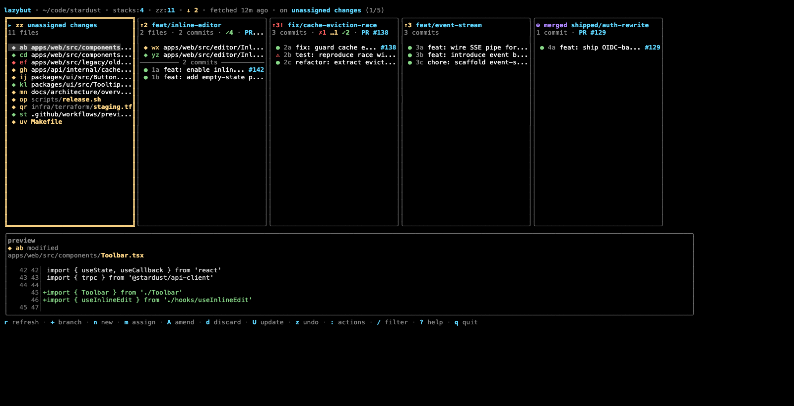

# LazyBut

`lazybut` is an experimental terminal client for [GitButler](https://www.gitbutler.com/).
It aims to bring the speed, keyboard-first ergonomics, and always-visible context of
LazyGit to GitButler's workspace model.



GitButler is excellent at organizing work into virtual branches and stacks. LazyBut is
the terminal companion: it keeps `zz` unassigned changes, active branch stacks, commits,
file or hunk IDs, previews, push state, upstream state, and PR-oriented actions visible
without leaving the CLI.

It is especially built for AI-agent-heavy development. GitButler's virtual branches are
a strong fit when several agents, assistants, or parallel workstreams touch the same
repository: each unit of work can stay isolated, reviewed, pushed, updated, or discarded
without losing the broader workspace context. LazyBut makes that agent-oriented workflow
usable directly from the terminal.

## Status

This is an early, usable prototype. It is intentionally small and delegates all real
GitButler behavior to the official `but` CLI instead of reimplementing Git logic.

## Requirements

- GitButler CLI available as `but` (the installer can install it for you)
- A Git repository; LazyBut can offer to run `but setup` on first start
- A terminal with color support; mouse support is optional but enabled when available
- Go 1.26+ only if building from source

## Install

macOS and Linux:

```sh
curl -fsSL https://raw.githubusercontent.com/OrdalieTech/LazyBut/main/install.sh | bash
```

This downloads the latest release binary. By default it installs to `/usr/local/bin`
when writable, otherwise to `~/.local/bin`. If `but` is not found, the installer
asks whether it should install the official GitButler CLI too.

Override the install directory or version:

```sh
LAZYBUT_INSTALL_DIR="$HOME/bin" curl -fsSL https://raw.githubusercontent.com/OrdalieTech/LazyBut/main/install.sh | bash
LAZYBUT_VERSION=v0.1.0 curl -fsSL https://raw.githubusercontent.com/OrdalieTech/LazyBut/main/install.sh | bash
```

For non-interactive installs:

```sh
LAZYBUT_INSTALL_GITBUTLER=1 curl -fsSL https://raw.githubusercontent.com/OrdalieTech/LazyBut/main/install.sh | bash
LAZYBUT_INSTALL_GITBUTLER=0 curl -fsSL https://raw.githubusercontent.com/OrdalieTech/LazyBut/main/install.sh | bash
```

Go install also works:

```sh
go install github.com/OrdalieTech/LazyBut/cmd/lazybut@latest
```

## Run

```sh
lazybut -C /path/to/gitbutler/repo
```

On startup, LazyBut checks the current repository. If the GitButler CLI is missing,
it opens an install confirmation. If the repo is not configured for GitButler yet,
it offers to run `but setup` before loading the workspace.

From a checkout:

```sh
go run ./cmd/lazybut -C /path/to/gitbutler/repo
```

Render a static snapshot without entering the TUI:

```sh
go run ./cmd/lazybut -C /path/to/gitbutler/repo -snapshot 120x36
```

## What It Does

- Shows GitButler's active workspace: `zz` unassigned changes plus active applied branches/stacks.
- Keeps AI-agent workstreams visible by making GitButler's virtual branches and unassigned work easy to inspect from the terminal.
- Provides LazyGit-style keyboard navigation: `h/l` or arrows between panels, `j/k` or arrows inside lists.
- Supports a wide-terminal kanban view inspired by the GitButler desktop workspace.
- Falls back to compact pane layouts on medium and narrow terminals.
- Shows file/commit previews via `but diff` and `but show`.
- Auto-refreshes GitButler state in the background: workspace status frequently, branch options less frequently.
- Runs mutations with `--status-after` so the UI refreshes from GitButler's own post-command state.
- Supports mouse click and wheel navigation in terminals that forward mouse events.
- Uses confirmation prompts for destructive or high-impact actions.

## Key Actions

- `r`: refresh
- `+` / `B`: add an inactive branch to the workspace
- `n`: create branch
- `m` / `a`: assign a change to a branch
- `c`: commit selected branch changes
- `A`: amend selected change into a commit
- `Q`: squash commits
- `d`: discard selected change
- `D`: delete selected branch
- `P`: push selected branch
- `Y`: push dry-run
- `p`: create PR
- `ctrl+p`: create draft PR
- `u`: non-mutating upstream check (`but pull --check`)
- `U`: refresh upstream state; if updates exist, open the update workspace flow (`but pull`)
- `z`: undo last GitButler operation
- `:`: action palette
- `?`: help

## Upstream Update Flow

LazyBut models GitButler desktop's "Update workspace" flow for the terminal:

- `U` first refreshes GitButler state when no incoming update is currently known.
- If there is nothing to pull, it shows `no upstream update`.
- If the target branch has incoming commits, it opens a navigable update modal.
- `u` remains available for a non-mutating check before running the update.
- `y` / `enter` runs `but pull`, which fetches the target branch and rebases/restacks applied branches.
- Conflicts reported by GitButler are surfaced in the TUI.

## Architecture

- `internal/gitbutler`: typed wrapper around the `but` CLI and GitButler JSON payloads.
- `internal/tui`: Bubble Tea model, rendering, navigation, prompts, modals, previews, and actions.
- `cmd/lazybut`: CLI entrypoint.
- `scripts`: local and GitHub-backed end-to-end validation helpers.

The code intentionally stays thin: GitButler remains the source of truth, and LazyBut focuses on terminal interaction, layout, and safe command orchestration.

## Testing

```sh
go test ./...
scripts/e2e-local.sh
go run ./cmd/lazybut -C /path/to/repo -snapshot 140x40
go run ./cmd/lazybut -C /path/to/repo -snapshot 96x32
go run ./cmd/lazybut -C /path/to/repo -snapshot 60x24
```

`scripts/e2e-local.sh` builds `lazybut`, creates disposable repositories under `/private/tmp`, exercises GitButler setup, responsive snapshots, branch/stack creation, assign, commit, push dry-run, push, pull check, pull, undo, oplog snapshot, clean, local merge, missing `but`, then tears the repositories down.

For the real GitHub path, run:

```sh
scripts/e2e-github.sh
```

It creates a private temporary GitHub repo, tests GitButler setup, snapshots, branch push, PR create/draft/ready, PR merge, and pull, then deletes the repo. It refuses to start unless `gh auth status` includes `delete_repo`, unless `LAZYBUT_GH_ALLOW_NO_DELETE_SCOPE=1` is set.

## Inspiration

LazyBut is heavily inspired by LazyGit's terminal ergonomics: fast navigation,
stable panels, visible shortcuts, responsive layouts, background refresh, and
keyboard-first workflows. The domain model is GitButler's, not Git's: virtual
branches, unassigned work, branch stacks, hunk/file IDs, and workspace updates.

## License

MIT
